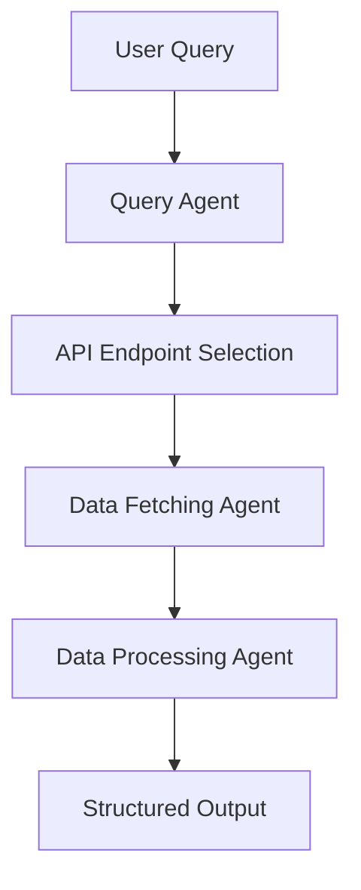

# **Orbit-2: Lightweight AI Query-to-Data Pipeline**  

## **🚀 What is Orbit-2?**  
Orbit-2 is a **faster, streamlined version of Orbit**, focusing **exclusively on backend efficiency** using **Phidata and agentic frameworks**. Unlike its predecessor, **Orbit-2 prioritizes direct transformations** instead of complex multi-step pipelines.

It is designed to:  
✅ **Map queries to the right API endpoints** (minimal API calls, optimized selection)  
✅ **Fetch & transform data quickly** (avoids deep retrieval layers)  
✅ **Process structured outputs directly** (no excessive pipeline overhead)  
✅ **Ensure high retrieval accuracy with modular agents**  

💡 **Why Orbit-2?**  
- Eliminates **slow frontend bottlenecks**  
- Removes **large pipelines & unnecessary retrieval steps**  
- Focuses **purely on structured query-to-data transformation**  

---

## **🔹 Key Features & System Design**  

🚀 **Agentic Query Processing** → Uses **Phidata** for modular agents  
🚀 **Fast Data Transformations** → Direct **Pandas-based** processing, avoiding LLM overhead  
🚀 **Minimal API Calls** → Smarter **endpoint selection for efficiency**  
🚀 **Cross-Domain Testing** → Built for **F1 queries**, tested on **finance, government, and climate data**  

---

## **📊 Performance Metrics**  

| **Capability** | **Best Accuracy** | **Challenges** |
|---------------|------------------|---------------|
| Query → Multi-Endpoint Selection | **100%** | Uses Ontology Mapping, Context Layer |
| Query → DataFrame | **96%** | Uses Transform for logic for all possible API endpoint; Not Scalable but easy to deploy for domain by domain |
| DataFrame → Analytics Code | **not tested%** |  |

---

## **🛠️ Architecture & Workflow**  

**Orbit-2 is built on a modular architecture with distinct processing agents:**  



🚀 **Key Enhancements Over Previous Versions**  
✅ **Agent-Based Query Processing** → Handles query understanding & API mapping separately  
✅ **Direct Data Transformation** → Avoids deep retrieval pipelines, simplifying processing  
✅ **Optimized Endpoint Selection** → Smart filtering minimizes unnecessary API calls  

---

## **📦 Tech Stack**  

✅ **Backend:** FastAPI, Phidata, Railway  
✅ **Data Processing:** Pandas, NumPy  
✅ **Agentic Framework:** Phidata Agents, LangChain (evaluated but not core)  
✅ **Deployment:** Vercel (Frontend, deprecated), Railway (Backend)  

---
## **🔮 Next Steps & Enhancements**  

🔹 **Improve Query → DataFrame Accuracy** (Reduce API failures & ID mismatches)  
🔹 **Enhance Mathematical Processing for Analytics Code**  
🔹 **Expand API Coverage to More Domains** (Beyond F1, integrate finance & climate)  
🔹 **Introduce Lightweight Caching for Speed Boost**  

<<<<<<< HEAD
---
=======
### 4. Streamlit Web Interface
Run the web interface for an interactive experience:
```bash
streamlit run frontend/app.py
```

## Example Queries
>>>>>>> a1-query

## **📌 Why Orbit-2 Matters?**  
Orbit-2 is built for **speed and efficiency**—it cuts out unnecessary steps and focuses purely on getting **structured, accurate insights from queries as fast as possible**.  

📌 **Ideal for:** Data engineers, AI practitioners, and backend developers **who need quick, accurate data transformation without deep pipelines.**  

---

### **💡 Final Takeaway**  
Orbit-2 **simplifies query-to-data processing**, making it faster, **more modular**, and **more reliable** than its predecessor.
