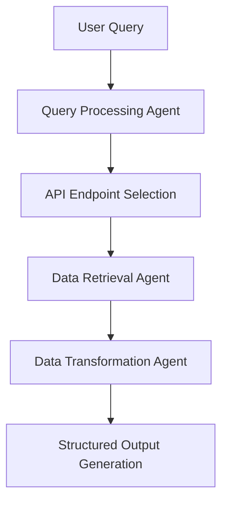

### **🚀 Dojo-1.1: Lightweight AI Query-to-Data Pipeline**  

---

## **What is Dojo-1.1?**  
**Dojo-1.1** is an **intermediate lightweight experiment** focused on **efficient query-to-data transformation**, optimized for **API-first AI workflows**. It builds on previous iterations by **reducing complexity, eliminating deep retrieval pipelines, and prioritizing fast, structured output processing.**  

Unlike full-scale orchestration platforms, **Dojo-1.1 acts as a streamlined AI-powered API query agent**, executing **direct API interactions with high accuracy and low overhead.**  

💡 **Why Dojo-1.1?**  
✅ **Minimal API Calls** → Smart query-to-endpoint mapping eliminates redundant requests  
✅ **Fast Data Transformations** → Uses **Pandas-based direct processing** (avoiding heavy LLM loads)  
✅ **Lightweight & Deployable** → Modular agentic approach ensures **domain-specific customization**  
✅ **Cross-Domain Testing** → Optimized for **F1 queries, financial data, and climate analytics**  

---

## **🔹 Key Features & System Design**  

🚀 **Agentic Query Processing** → Uses **Phidata-based modular agents**  
🚀 **Efficient Data Transformations** → Direct **NumPy/Pandas processing**, skipping multi-hop reasoning  
🚀 **Optimized API Calls** → Ontology-driven **endpoint selection** for **query efficiency**  
🚀 **Scalability for Domain-Specific Use Cases** → Primed for **structured API-driven data extraction**  

---

## **📊 Performance Metrics**  

| **Capability** | **Best Accuracy** | **Challenges** |
|---------------|------------------|---------------|
| Query → Multi-Endpoint Selection | **100%** | Relies on Ontology Mapping & Context Filtering |
| Query → DataFrame Transformation | **96%** | Works well in domain-specific applications, but lacks universal scalability |
| DataFrame → Analytics Code Generation | **Not Tested** | Future step for AI-driven automated reporting |

---

## **🛠️ Architecture & Workflow**  

Dojo-1.1 is designed as a **lightweight, modular AI query agent** with distinct processing steps:  

🚀 **Key Enhancements Over Previous Versions**  
✅ **Agent-Based Query Processing** → Handles query interpretation & API mapping separately  
✅ **Direct Data Transformation** → No deep retrieval pipelines, simplifying processing  
✅ **Smart API Call Optimization** → Adaptive filtering ensures **low-latency, high-relevance** results  

---

## **📦 Tech Stack**  

✅ **Backend:** FastAPI, Phidata, Railway  
✅ **Data Processing:** Pandas, NumPy  
✅ **Agentic Framework:** Phidata Agents, LangChain (evaluated but not core)  
✅ **Infrastructure & Deployment:** AWS Lambda, Railway for backend, PostgreSQL for lightweight storage  

---

## **🔮 Next Steps & Enhancements**  

🔹 **Improve Query → DataFrame Accuracy** (Reduce API failures & ID mismatches)  
🔹 **Enhance Mathematical Processing for Analytics Code**  
🔹 **Expand API Coverage to More Domains** (Beyond F1, integrate finance & climate datasets)  
🔹 **Introduce Lightweight Caching for Speed Boost**  

---

## **📌 Why Dojo-1.1 Matters?**  
Dojo-1.1 focuses on **efficiency, speed, and modularity**—it removes unnecessary LLM overhead and prioritizes **structured, real-time API-driven insights.**  

📌 **Ideal for:** Data engineers, API developers, and AI practitioners **who need rapid, structured data transformation without deep AI orchestration.**  

---

### **💡 Final Takeaway**  
Dojo-1.1 **is a stepping stone towards scalable API-driven AI automation**, ensuring high-speed, **domain-specific query execution** with minimal overhead. 🚀  
