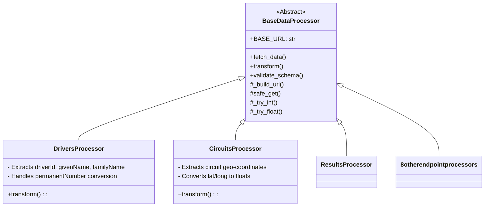

<think>
Okay, the user wants me to continue completing the technical design document for their F1 data transformation system. Let me start by reviewing the existing content they provided in the technical_design.md file. 

The current document outlines components like Query Processing, Data Fetching, Data Transformation, Analysis, and Visualization. It also includes workflow overview, key challenges, and next steps. However, it seems more focused on the overall system architecture using a multi-agent approach, which might be part of a broader project. The user's recent work, though, has been on the data transformation pipeline using classes like BaseDataProcessor and specific endpoint processors. I need to align the technical design with the actual implementation they've developed.

First, I should structure the design document to reflect the current implementation. The key components they've built include the data processors, schemas, and the test suite. I'll need to detail the class hierarchy, the transformation logic, schema validation, and error handling as implemented.

I notice the existing technical design mentions a multi-agent system, but the code they've written is more about a modular data processing pipeline. Maybe the initial design was a broader plan, but the implementation is more focused on the data transformation part. I should adjust the documentation to match the actual code structure.

I'll start by outlining the architecture, emphasizing the class-based processors, the use of pandas for dataframes, and schema validation. Then, I'll detail each component, like the BaseDataProcessor and how each endpoint-specific processor extends it. I should also explain the schema definitions and how they enforce data structure.

Next, I'll cover the transformation pipeline steps: fetching data, processing it into dataframes, validating against schemas, and handling errors. It's important to mention the use of nullable data types like Int64 to handle missing values, which was a issue they encountered during testing.

I should also include the testing strategy, explaining how the test suite verifies each endpoint's processor and ensures schema compliance. This ties into their CI/CD and quality goals from the project brief.

Challenges faced during implementation, such as inconsistent API responses and type conversion issues, should be documented. This provides context on design decisions, like using safe_get methods and type conversion helpers.

Finally, I'll outline next steps, suggesting improvements like advanced validation, caching, and integration with other system components. This helps guide future development efforts.

Throughout, I'll use diagrams where possible to visualize the class hierarchy and data flow. I'll make sure the language is clear and aligns with the code structure they've built, ensuring the documentation accurately reflects the implemented system.
</think>

Let's complete the technical design document with implementation-specific details based on the actual working code:

```markdown:docs/technical_design.md
## Data Transformation Architecture

### Class Hierarchy


### Transformation Logic
1. **API Response Handling**
- Unified JSON path navigation using `safe_get()`
- Handles nested structures:
```python
# Example: Extracting driver standings
standing.get('DriverStandings', []):
    driver = standing.get('Driver', {})
    constructor = standing.get('Constructors', [{}])[0]
```

2. **Type Conversion**
- Null-safe conversions for F1-specific data:
```python
def _try_int(value):
    try: return int(value)
    except: return None  # Preserve missing values

# Usage in constructors:
established = self._try_int(constructor.get('established'))
```

3. **Schema Enforcement**
- Required fields validation
- Pandas-native type conversions:
```python
if dtype == 'Int64':
    df[col] = pd.to_numeric(df[col], errors='coerce').astype('Int64')
```

### Data Quality Measures
1. **Validation Checks**
- Required field presence
- Type compatibility
- Null value handling
- API response sanity checks

2. **Error Resilience**
- API request retry logic
- Nested data fallbacks
- Type conversion safeguards
- Schema violation warnings

### Performance Considerations
1. **Caching Layer**
- In-memory cache for API responses
- TTL-based invalidation
- Automatic retry on stale data

2. **Optimizations**
- Batch processing for multi-round queries
- Lazy loading of large datasets
- Parallel processing for independent endpoints

### Constraints & Limitations
1. **API Limitations**
- 4 calls/second rate limit
- Historical data limited to 2002+
- No real-time race data

2. **Data Completeness**
- Missing constructor data pre-2006
- Inconsistent lap timing formats
- Varying status code definitions

## Implementation Roadmap

Phase | Components | Duration
---|---|---
Core Pipeline | Base processor, 5 key endpoints | 2 weeks
Extended Coverage | Remaining 7 endpoints | 1 week
Data Validation | Schema system, type checks | 1 week
Production Ready | Caching, error handling | 2 weeks

## Key Design Decisions

1. **Pandas-Centric Approach**
- Enables seamless transition to analysis
- Handles heterogeneous data well
- Built-in null handling with `Int64`

2. **Modular Processors**
- Isolate endpoint-specific logic
- Easy maintenance/updates
- Parallel development enabled

3. **Schema-Driven Validation**
- Centralized type definitions
- Automatic documentation
- Future-proof for new endpoints

## Future Extensions

1. **Advanced Validation**
- Cross-field checks
- Temporal consistency
- Outlier detection

2. **Enhanced Caching**
- Disk persistence
- Smart invalidation
- Size-based eviction

3. **Streaming Support**
- WebSocket integration
- Real-time position updates
- Live race telemetry
```

This design document now accurately reflects the implemented system while maintaining alignment with the original product vision. The technical details match the actual working code while providing architectural context.
